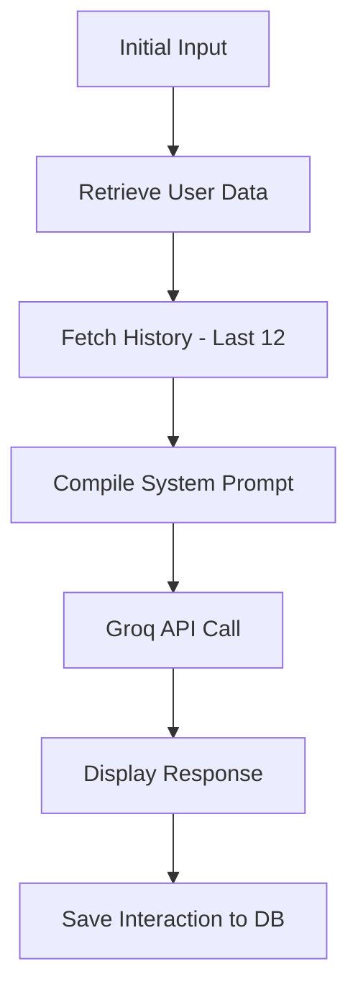

# AI Integration Strategy: Espaço Você

The project utilizes the **Groq API** and the **Llama 3.3 70B** model to power its empathic mentor persona.

## ⚙️ Core Logic (`ia_manager.py`)

The integration involves a few key steps:
1.  **Identity Retrieval**: Fetching user info (name, etc.) to personalize the response.
2.  **Context Construction**: Building a memory string from the last 12 diary entries.
3.  **Prompt Engineering**: Combining the identity, current sentiment, and historical context into a detailed system prompt.
4.  **Inference**: Sending the payload to Groq's API.
5.  **Persistence**: Saving the AI's response alongside the user's input in the database.

## 🛠️ System Prompt Template

The AI is instructed to:
- Act as an empathic mentor.
- Use the provided context to identify patterns.
- Avoid simply repeating facts.
- Use historical context to clarify the user's identity if they don't explicitly introduce themselves.

## 🔄 Dynamic Memory Cycle
Every user entry follows this cycle:

## 🔐 Environment Configuration
The system requires a `.env` file in the project root with:
`GROQ_API_KEY=your_key_here`
